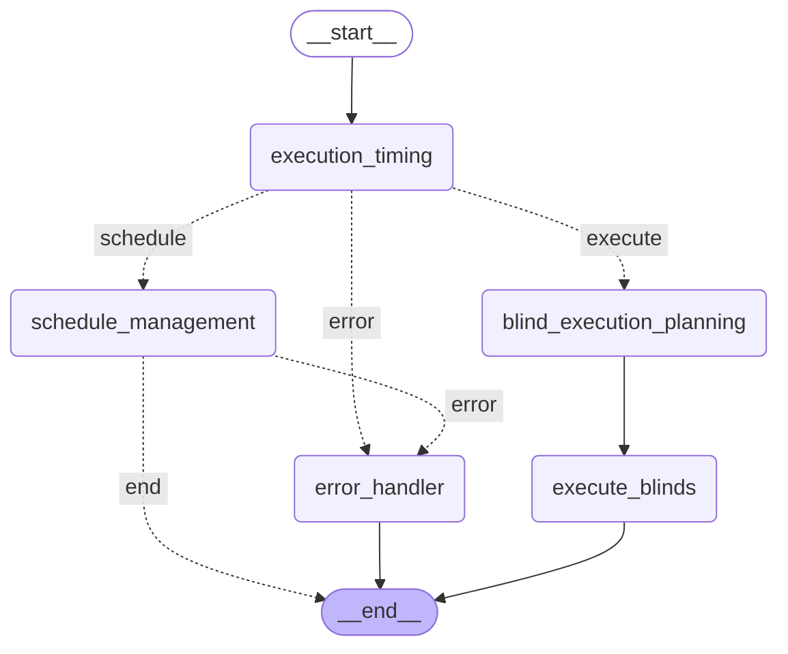

# Smart Shades Agent

A **LangGraph-based** intelligent agent for smart shades control and automation using Azure OpenAI and Hubitat Z-Wave integration.

## Overview

This project implements an AI agent using **LangGraph** that can intelligently control Z-Wave smart shades through [Hubitat](https://hubitat.com/) using natural language commands. The agent features a state-based workflow that can handle both immediate execution and intelligent scheduling with automatic duration support and solar intelligence.

## Features

- **Natural Language Control**: "Open the front shade", "Close all blinds", "Im starting a movie"
- **Multi-Blind Operations**: "Open the side window halfway, and front window fully"
- **Room-specific and house-wide control**: "Close all the blinds in the house 9 and 3 quarters"
- **Solar Intelligence**: "Close the blinds 30 minutes after sunset today", "Open the blinds at sunrise"
- **Smart Scheduling**: "Open the blinds at 9am everyday", "Close the blinds everyday after sunset"
- **Specific blind targeting by name or keyword**
- **RESTful API** for external integrations (Apple Shortcuts & Siri, Home Assistant, etc.)
- **Structured Output Parsing**: Pydantic models ensure reliable command interpretation

## Architecture Overview



### **LangGraph Workflow Nodes:**

1. **`execution_timing`**: Analyzes user commands to determine if they require immediate execution or scheduling
2. **`schedule_management`**: Handles scheduled operations with duration parsing and automatic cleanup  
3. **`blind_execution_planning`**: Plans immediate blind control operations with intelligent targeting
4. **`execute_blinds`**: Executes blind control commands via Hubitat API
5. **`error_handler`**: Handles errors and provides user-friendly error messages

### **Key Components:**

- **LangGraph StateGraph**: Manages workflow state and routing decisions
- **Azure OpenAI Integration**: Powers natural language understanding across all chains
- **APScheduler**: Handles scheduled operations with solar time support
- **Duration Parsing**: LLM-based parsing of natural language durations ("for the next week")
- **Solar Utils**: Sunrise/sunset calculations with timezone support
- **Hubitat Integration**: Direct Z-Wave device control through Maker API

## How It Works

1. **Command Reception**: User sends natural language command via REST API
2. **Execution Timing Analysis**: LangGraph determines if command is immediate or scheduled
3. **Routing Decision**: Commands are routed to either blind execution planning or schedule management
4. **Command Processing**: 
   - **Immediate**: Blind execution planning analyzes command and targets specific blinds
   - **Scheduled**: Schedule management creates schedules with duration parsing and solar time support
5. **Execution**: Commands sent to Hubitat hub which controls Z-Wave devices
6. **Response**: Structured response returned to user with execution results

## API Endpoints

The Smart Shades Agent provides a comprehensive REST API:

| Endpoint | Method | Description |
|----------|---------|-------------|
| `/rooms/{room}/control` | POST | Control blinds with natural language |
| `/rooms/{room}/status` | GET | Get current blind positions |
| `/rooms/{room}/schedules` | GET | List active schedules for room |
| `/rooms/{room}/schedules` | POST | Create new schedule for room |
| `/rooms/{room}/schedules/{schedule_id}` | DELETE | Delete specific schedule |
| `/rooms/{room}/solar` | GET | Get sunrise/sunset times for scheduling |
| `/rooms` | GET | List all available rooms |
| `/docs` | GET | Swagger documentation |

## Hardware Requirements

### Hubitat Hub Setup
1. **Hubitat Elevation Hub** (C-7 or newer recommended)
2. **Z-Wave Smart Shades/Blinds** (tested with devices supporting position control)
3. **Network connectivity** between your computer and Hubitat hub

### Supported Z-Wave Shade Devices
- Any Z-Wave shade controller that supports position commands (0-100%)
- Examples: Somfy, Lutron, Hunter Douglas, etc.
- Device must be paired with your Hubitat hub

## Setup Instructions

### 1. Hubitat Configuration

#### Enable Maker API
1. Log into your Hubitat hub web interface
2. Go to **Apps** → **Add Built-In App**
3. Select **Maker API**
4. Choose your shade devices to include in the API
5. Note the **Access Token** and **API URL** (you'll need these)

#### Find Device IDs
1. In Hubitat, go to **Devices**
2. Click on each shade device
3. Note the **Device Network ID** (this is your device ID)
4. Test device control using the device page

### 2. Environment Configuration

Create a `.env` file in the project root:

```bash
# Azure OpenAI Configuration
AZURE_OPENAI_API_KEY=your_azure_openai_api_key
AZURE_OPENAI_ENDPOINT=https://your-resource.openai.azure.com/
AZURE_OPENAI_DEPLOYMENT_NAME=your_deployment_name
AZURE_OPENAI_API_VERSION=2024-02-15-preview

# Hubitat Configuration
HUBITAT_ACCESS_TOKEN=your_maker_api_access_token
HUBITAT_API_URL=http://your-hubitat-ip

# API Configuration (optional)
API_HOST=0.0.0.0
API_PORT=8000
LOG_LEVEL=INFO
```

### 3. Blinds Configuration

Edit `blinds_config.json` to match your setup:

```json
{
  "makerApiId": "1",
  "location": {
    "city": "Seattle, WA",
    "timezone": "America/Los_Angeles"
  },
  "houseInformation": {
    "orientation": "east-west",
    "notes": "Guest bedroom faces east, master bedroom faces west"
  },
  "rooms": {
    "guest_bedroom": {
      "blinds": [
        {
          "id": "123",
          "name": "Guest Side Window",
          "orientation": "North"
        },
        {
          "id": "124", 
          "name": "Guest Front Window",
          "orientation": "East"
        }
      ]
    },
    "master_bedroom": {
      "blinds": [
        {
          "id": "125",
          "name": "Master West Window", 
          "orientation": "West"
        }
      ]
    }
  }
}
```

**Configuration Notes:**
- `id`: Use the Device Network ID from Hubitat
- `name`: Friendly name for voice commands
- `orientation`: Cardinal direction for solar intelligence (North, South, East, West)
- `city`: Your city for automatic coordinate lookup and sun calculations
- `timezone`: Your local timezone for accurate solar times

### 4. Installation and Running

1. **Install dependencies:**
   ```bash
   pip install -r requirements.txt
   ```

3. **Run the agent:**
   ```bash
   python src/main.py
   ```

4. **Access the API:**
   - Swagger UI: http://localhost:8000/docs
   - API Base: http://localhost:8000

## Integration Examples

### Apple Shortcuts
1. Create new shortcut
2. Add "Get Contents of URL" action
3. Set URL: `http://your-ip:8000/rooms/guest_bedroom/control`
4. Set Method: POST
5. Set Request Body: `{"command": "Ask Siri for input"}`
6. Add "Speak Text" action with response message

### Home Assistant
```yaml
rest_command:
  smart_shades:
    url: "http://your-ip:8000/rooms/{{ room }}/control"
    method: POST
    headers:
      Content-Type: application/json
    payload: '{"command": "{{ command }}"}'
```

## Docker Deployment

Build and run with Docker:

```bash
docker build -t smart-shades-agent .
docker run -p 8000:8000 --env-file .env smart-shades-agent
```

## Project Structure

```
├── src/
│   ├── agent/          # LangGraph agent implementation (V2)
│   ├── chains/         # LangChain chains for command processing
│   │   ├── execution_timing.py      # Immediate vs scheduled detection
│   │   ├── schedule_management.py   # Schedule creation and management
│   │   ├── duration_parsing.py      # Natural language duration parsing
│   │   └── blind_execution_planning_v2.py  # Immediate execution planning
│   ├── models/         # Pydantic data models and schemas
│   ├── utils/          # Utility modules (solar, hubitat, scheduling)
│   ├── api/            # FastAPI endpoints and routers
│   └── main.py         # FastAPI application entry point
├── blinds_config.json  # Hubitat device configuration
├── .env               # Environment variables (create from template)
├── .env.example       # Environment variables template
├── Dockerfile         # Container configuration
├── requirements.txt   # Python dependencies
├── smart_shades_agent_v2_graph.mmd  # LangGraph workflow diagram
└── README.md          # This file
```

## License

MIT License
